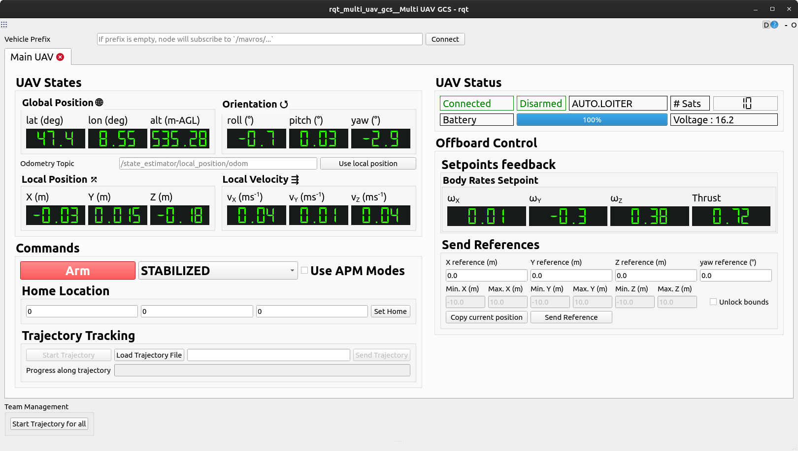

# RQT Multi UAV GCS

This is my Ground Control Station for flying one or more PX4/Ardupilot-based quadrotors in [Offboard](https://docs.px4.io/main/en/flight_modes/offboard.html) or [Guided](https://ardupilot.org/copter/docs/ac2_guidedmode.html) mode.



## Prerequisites

This GCS depends on the [FSC Lab's autopilot framework](https://github.com/FSC-Lab/fsc_autopilot) to navigate quadrotors from point to point.
Follow instructions on that repository to install it into your ROS workspace.

## Installation

Clone this repository into your ROS workspace, then run

```
catkin build rqt_multi_uav_gcs
```

## Running

Simply run

```
rosrun rqt_multi_uav_gcs rqt_multi_uav_gcs
```

and the window in the foregoing image will be displayed

## Usage

WIP
